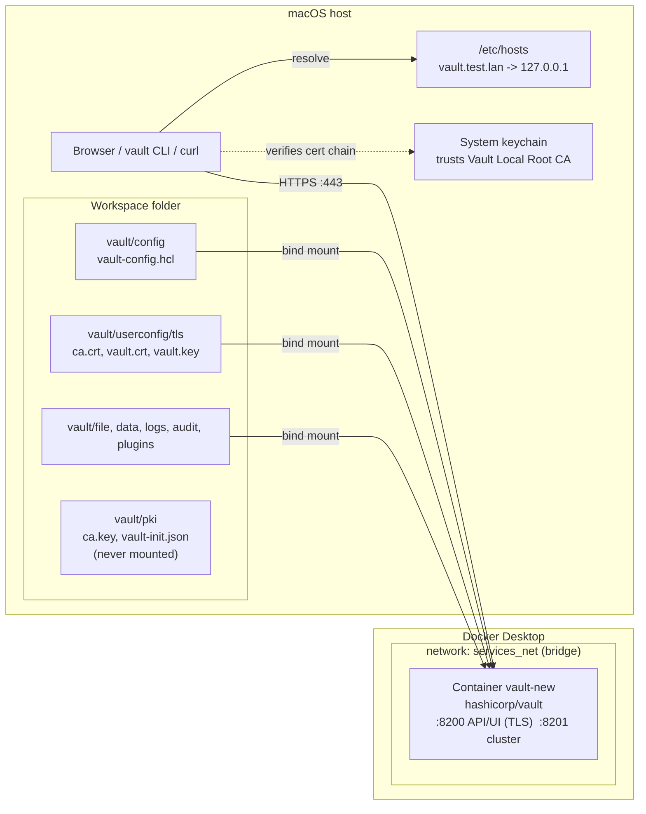
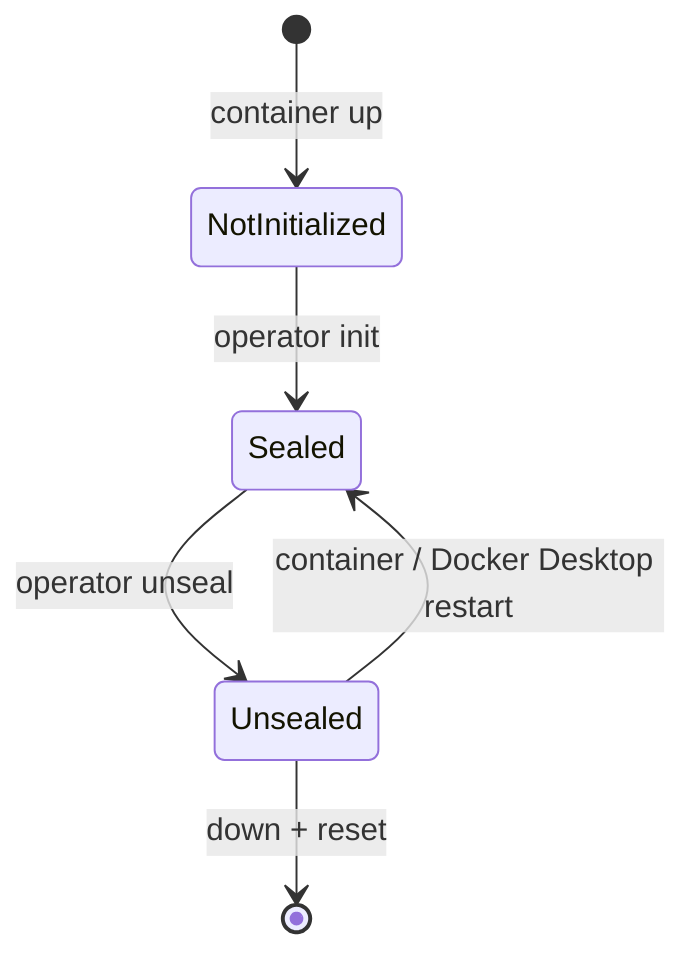
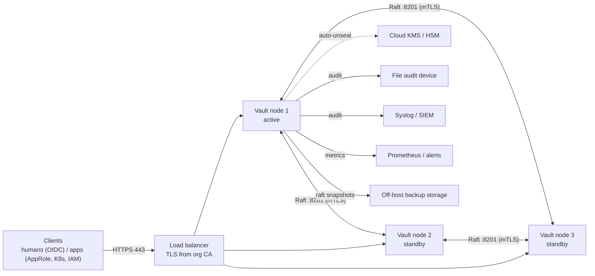

# High-Level Design: Local HashiCorp Vault on Docker Desktop

## 1. Purpose
Provide a local Vault instance for development and testing, reachable over trusted HTTPS at `https://vault.test.lan`, with the full setup reproducible by one script.

## 2. Goals and non-goals
**Goals**
- TLS end to end, using a local root CA trusted by the host OS
- Persistent storage that survives container restarts
- Everything contained in the workspace folder (no host paths like `/vault`)
- Reproducible, idempotent setup (`setup.sh`)

**Non-goals**: high availability, production hardening, auto-unseal, cloud KMS, multi-node clusters.

## 3. Architecture


ASCII summary:
```
Browser/CLI --(vault.test.lan -> 127.0.0.1, HTTPS :443)--> Docker Desktop
   host:443 -> container:8200 (TLS)      host:8201 -> container:8201 (cluster)
   container mounts ./vault/* from the workspace; CA private key stays outside
```

## 4. Components
| Component | Role |
|---|---|
| `vault-new` container | Runs `vault server` with `vault-config.hcl`; `IPC_LOCK` capability, `disable_mlock = true` |
| `docker-compose.yml` | Defines the service, ports, bind mounts, env, and the `services_net` bridge network |
| `vault-config.hcl` | TLS listener on 8200/8201, file storage at `/vault/file`, UI on, `api_addr` set to `https://vault.test.lan` |
| `vault_cert.conf` | Subject CN `vault.test.lan`; SANs `*.test.lan`, `localhost`, `127.0.0.1`; serverAuth usage |
| Local root CA | `Vault Local Root CA`, RSA 4096, 10 years; signs the server cert |
| Server cert | RSA 2048, 825 days, chain file (leaf + CA) |
| `setup.sh` | Idempotent automation of all steps |
| Skill `vault-docker-setup` | Step-by-step runbook for Claude Code |

## 5. Trust and PKI flow
1. Generate CA key (`vault/pki/ca.key`) and self-signed CA cert (`CA:TRUE`).
2. Generate server key and CSR, using `vault_cert.conf` for subject and SANs.
3. CA signs the CSR with the `v3_req` extensions, then the CA cert is appended to form a chain.
4. Host: CA added to the System keychain (macOS `security add-trusted-cert`) so browsers, curl and the CLI verify without extra flags.
5. Container: `ca.crt` mounted into `/usr/local/share/ca-certificates/` and `VAULT_CACERT` set, so tools inside the container trust it as well.

The CA private key is never mounted into the container.

## 6. Network and ports
| Host | Container | Purpose |
|---|---|---|
| 443 | 8200 | API and UI (TLS) |
| 8201 | 8201 | Cluster port (published, unused in single node) |

Name resolution is by `/etc/hosts` (`127.0.0.1 vault.test.lan`). No DNS server is involved.

## 7. Storage and state
| Path (host) | Container | Contents |
|---|---|---|
| `vault/file` | `/vault/file` | Vault encrypted storage (file backend) |
| `vault/config` | `/vault/config` | Server config |
| `vault/userconfig` | `/vault/userconfig` | TLS material |
| `vault/logs`, `audit`, `plugins`, `data` | same under `/vault` | Logs, audit devices, plugins, misc |

Data is plain bind-mounted, so it persists across `docker compose down` and is removed only by `./setup.sh reset`.

## 8. Lifecycle

Health codes: 501 not initialized, 503 sealed, 200 active.

## 9. Security considerations
| Risk | Mitigation / status |
|---|---|
| Unseal key and root token exposure | Saved to `vault/pki/vault-init.json` (600, gitignored, not mounted). Dev only; move offline for anything real |
| Single key share | Accepted for dev. Use 5/3 Shamir or auto-unseal for production |
| Root token in daily use | Create limited policies/tokens; revoke root after setup |
| `vault.key` is mode 644 | Needed for the container user (uid 100); acceptable on a local dev machine |
| CA trusted system-wide | Anyone with `ca.key` could mint trusted certs; key stays in gitignored `vault/pki` (600). Remove trust when done |
| Secrets in Git | `.gitignore` covers keys, certs, `vault/pki`, and Vault data |
| TLS | Wildcard SAN limited to `*.test.lan`; certs max 825 days (macOS limit) |

## 10. Decisions and changes from the original compose file
| Decision | Reason |
|---|---|
| Relative bind mounts (`./vault/...`) | Absolute `/vault/...` host paths don't exist on macOS / aren't shared with Docker Desktop |
| `userconfig` made a bind mount | It was an undeclared named volume (compose error) |
| Mount only `ca.crt` into the container trust dir | Host `/etc/ssl/certs/ca-certificates.crt` doesn't exist on macOS and would overwrite the container bundle |
| Dropped `privileged: true` | `IPC_LOCK` + `disable_mlock` is sufficient |
| Separate root CA instead of one self-signed leaf | A non-CA leaf can't act as a trusted root |
| File storage | Simple, no extra services; Raft would be next for HA |

## 11. Future work
- Auto-unseal (cloud KMS or transit)
- Raft integrated storage / multi-node
- Audit device enabled to `vault/audit`
- Auth methods and policies instead of the root token
- Cert rotation job (`./setup.sh certs` already regenerates when < 30 days remain)

## 12. Production deployment
The dev topology (section 3) is a single container, file storage, one key share and a locally trusted CA. A production design changes each of those.

### 12.1 Target architecture


### 12.2 Dev vs production
| Area | This repo (dev) | Production |
|---|---|---|
| Nodes | 1 container | 3 or 5 nodes across failure domains |
| Platform | Docker Desktop, Compose | VMs or Kubernetes (official Helm chart), config management |
| Storage | `file` backend | Integrated Storage (Raft) + scheduled snapshots |
| TLS | Local CA, trusted on one host | Org PKI/ACME; Raft/cluster traffic on TLS; real DNS, no `/etc/hosts` |
| Unseal | Manual, 1 share, key in `vault-init.json` | Auto-unseal (KMS/HSM/transit); recovery keys 5/3, PGP-encrypted |
| Root token | Saved and used | Used once, then revoked |
| Auth | Root token | OIDC/LDAP (humans), AppRole/K8s/IAM (workloads), short TTLs |
| Audit | None | At least two devices, enabled first |
| Image | `latest` | Pinned version, scanned, non-root, no `privileged` |
| Observability | `docker logs` | Telemetry, seal/audit/leader alerts, log shipping |
| Backup/DR | None | Snapshot schedule, tested restore, optional replication (Enterprise) |

### 12.3 Rollout steps
1. **Provision** nodes, network (only 443 from clients, 8201 between nodes), DNS and a load balancer with a health check on `/v1/sys/health?standbyok=true`.
2. **Certificates:** issue server certs from the org CA with SANs for the DNS name and node names. Remove the dev CA from any shared trust stores.
3. **Configure** each node: `storage "raft"` with `retry_join` to peers, a `seal "awskms"` (or `azurekeyvault`, `gcpckms`, `transit`) stanza, TLS listener, `api_addr`/`cluster_addr` per node, `disable_mlock = false` with swap disabled.
4. **Initialize once** on node 1: `vault operator init -key-shares=5 -key-threshold=3 -recovery-shares=5 -recovery-threshold=3 -pgp-keys=...`. Hand each encrypted share to a different custodian. Nothing is written to disk in plaintext.
5. **Join** the other nodes (`retry_join`, or `vault operator raft join`). With auto-unseal they unseal themselves.
6. **Bootstrap with the root token (once):**
   1. Enable two audit devices.
   2. Enable auth methods and write admin and application policies.
   3. Verify an admin can log in through the normal auth method.
   4. `vault token revoke -self` to retire the root token.
7. **Operationalize:** enable telemetry and alerts, schedule `raft snapshot save`, document and test restore, and test node loss and an upgrade.
8. **Secrets engines and onboarding:** mount KV/PKI/database engines, onboard teams via policies and auth roles.

### 12.4 Root token: is it required, and how is it protected?
Not required after bootstrap. Vault creates it at `init` so that someone can configure an empty cluster. Once an auth method, policies and audit devices exist, the root token (no expiry, full access) is a liability and should be revoked.

| Control | How |
|---|---|
| Minimize lifetime | Revoke right after bootstrap (`vault token revoke -self`) |
| Break-glass | `vault operator generate-root` with a quorum of unseal/recovery key holders; short-lived, revoked after use |
| Split custody | PGP-encrypted shares, held by different people: no single person can mint root |
| No plaintext storage | Not in files, history, CI, chat or tickets; `vault-init.json` from `setup.sh` is dev only |
| Detection | Audit devices on; alert on any request carrying a `root` policy token or `generate-root` activity |
| Least privilege day to day | Admin policies with scoped capabilities, short TTLs, MFA/OIDC for humans |
| Response to leak | Revoke token; if shares leaked, `vault operator rekey` (and `rotate` the keyring) |

Sentinel/Control Groups (Enterprise) can additionally require multiple approvers for sensitive paths.
